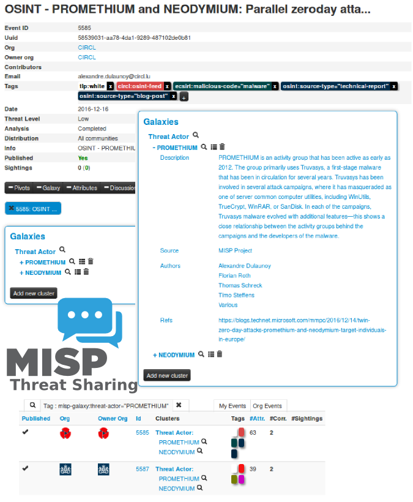

# misp-galaxy

MISP galaxy is a simple method to express a large object called cluster that can be attached to MISP events or
attributes. A cluster can be composed of one or more elements. Elements are expressed as key-values. There
are default vocabularies available in MISP galaxy but those can be overwritten, replaced or updated as you wish.

Existing clusters and vocabularies can be used as-is or as a template. MISP distribution can be applied
to each cluster to permit a limited or broader distribution scheme.

Vocabularies are from existing standards (like STIX, Veris, MISP and so on) or custom ones.

The objective is to have a comment set of clusters for organizations starting analysis but that can be expanded
to localized information (which is not shared) or additional information (that can be shared).

# Available clusters

- [clusters/android.json](clusters/android.json) - Android malware galaxy based on multiple open sources.
- [clusters/banker.json](clusters/banker.json) - A list of banker malware.
- [clusters/branded_vulnerability.json](clusters/branded_vulnerability.json) - List of known vulnerabilities and exploits.
- [clusters/exploit-kit.json](clusters/exploit-kit.json) - Exploit-Kit is an enumeration of some exploitation kits used by adversaries. The list includes document, browser and router exploit kits. It's not meant to be totally exhaustive but aim at covering the most seen in the past 5 years.
- [clusters/microsoft-activity-group.json](clusters/microsoft-activity-group.json) - Activity groups as described by Microsoft.
- [clusters/preventive-measure.json](clusters/preventive-measure.json) - Preventive measures.
- [clusters/ransomware.json](clusters/ransomware.json) - Ransomware galaxy based on https://docs.google.com/spreadsheets/d/1TWS238xacAto-fLKh1n5uTsdijWdCEsGIM0Y0Hvmc5g/pubhtml
- [clusters/rat.json](clusters/rat.json) - remote administration tool or remote access tool (RAT), also called sometimes remote access trojan, is a piece of software or programming that allows a remote "operator" to control a system as if they have physical access to that system.
- [clusters/tds.json](clusters/tds.json) - TDS is a list of Traffic Direction System used by adversaries.
- [clusters/threat-actor.json](clusters/threat-actor.json) - Adversary groups - Known or estimated adversary groups targeting organizations and employees. Adversary groups are regularly confused with their initial operation or campaign. MISP
- [clusters/tool.json](clusters/tool.json) - tool is an enumeration of tools used by adversaries. The list includes malware but also common software regularly used by the adversaries.

- [clusters/mitre_attack-pattern.json](clusters/mitre_attack-pattern.json) - Attack Pattern - MITRE Adversarial Tactics, Techniques & Common Knowledge (ATT&CK)
- [clusters/mitre_course-of-action.json](clusters/mitre_course-of-action.json) - Course of Action - MITRE Adversarial Tactics, Techniques & Common Knowledge (ATT&CK)
- [clusters/mitre_intrusion-set.json](clusters/mitre_intrusion-set.json) - Intrusion Test - MITRE Adversarial Tactics, Techniques & Common Knowledge (ATT&CK)
- [clusters/mitre_malware.json](clusters/mitre_malware.json) - Malware - MITRE Adversarial Tactics, Techniques & Common Knowledge (ATT&CK)
- [clusters/mitre_tool.json](clusters/mitre_tool.json) - Tool - MITRE Adversarial Tactics, Techniques & Common Knowledge (ATT&CK)

- [clusters/sectors.json](clusters/sectors.json) - Activity sectors
- [clusters/cert-eu-govsector.json](clusters/cert-eu-govsector.json) - Cert EU GovSector

# Available Vocabularies

A [readable PDF overview of the MISP galaxy is available](https://www.misp.software/galaxy.pdf) or [HTML](https://www.misp.software/galaxy.html) and generated from the JSON.

## Common

- [vocabularies/common/certainty-level.json](vocabularies/common/certainty-level.json) - Certainty level of an associated element or cluster.
- [vocabularies/common/threat-actor-type.json](vocabularies/common/threat-actor-type.json) - threat actor type vocab as defined by Cert EU.
- [vocabularies/common/ttp-category.json](vocabularies/common/ttp-category.json) - ttp category vocab as defined by Cert EU.
- [vocabularies/common/ttp-type.json](vocabularies/common/ttp-type.json) - ttp type vocab as defined by Cert EU.

## Threat Actor

- [vocabularies/threat-actor/cert-eu-motive.json](vocabularies/threat-actor/cert-eu-motive.json) - Motive vocab as defined by Cert EU.
- [vocabularies/threat-actor/intended-effect-vocabulary.json](vocabularies/threat-actor/intended-effect.json) - The IntendedEffectVocab is the default STIX vocabulary for expressing the intended effect of a threat actor. STIX 1.2.1
- [vocabularies/threat-actor/motivation-vocabulary.json](vocabularies/threat-actor/motivation.json) - The MotivationVocab is the default STIX vocabulary for expressing the motivation of a threat actor. STIX 1.2.1
- [vocabularies/threat-actor/planning-and-operational-support-vocabulary.json](vocabularies/threat-actor/planning-and-operational-support.json) - The PlanningAndOperationalSupportVocab is the default STIX vocabulary for expressing the planning and operational support functions available to a threat actor.
- [vocabularies/threat-actor/sophistication.json](vocabularies/threat-actor/sophistication.json) - The ThreatActorSophisticationVocab enumeration is used to define the default STIX vocabulary for expressing the subjective level of sophistication of a threat actor.
- [vocabularies/threat-actor/type.json](vocabularies/threat-actor/type.json) - The ThreatActorTypeVocab enumeration is used to define the default STIX vocabulary for expressing the subjective type of a threat actor.

## MISP Integration

Starting from [MISP 2.4.56](http://www.misp-project.org/2016/12/07/MISP.2.4.56.released.html), galaxy is integrated within the MISP threat sharing platform and users can directly benefit from the available clusters to attach them to the MISP event.

## How to contribute?

In the world of threat intelligence, there are many different models or approaches to order, classify or describe threat actors, threats or activity groups. We welcome new ways of describing threat intelligence as the galaxy model allows to reuse the ones you use or trust for your organization or community.

Fork the project, update or create elements or clusters and make a pull-request.

We recommend to validate the JSON file using [jq](https://stedolan.github.io/jq/) and [validate_all.sh](https://github.com/MISP/misp-galaxy/blob/master/validate_all.sh) before doing a pull-request.

## License

MISP galaxy is licensed under [CC0 1.0 Universal (CC0 1.0)](https://creativecommons.org/publicdomain/zero/1.0/) -  Public Domain Dedication.
